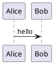

The `@streamdown/plantuml` plugin renders [PlantUML](https://plantuml.com/) diagrams in the browser using the official TeaVM engine (`@plantuml/core`). The engine stays out of your bundler graph until you import the engine entry, and it only runs when a `plantuml` or `puml` fence is actually rendered.

- Interactive controls (fullscreen, download, copy)
- Dark-mode rendering when the page is in dark theme
- Custom error handling with retry

## Install

```package-install
npm install @streamdown/plantuml @plantuml/core
```

`@plantuml/core` is an optional peer dependency: importing the engine entry is what pulls it into your bundler's module graph, so apps that don't use the plugin never bundle it.

## Usage

```tsx title="chat.tsx" lineNumbers
import { createPlantUmlPlugin } from '@streamdown/plantuml';
import { engine } from '@streamdown/plantuml/engine';

const plantuml = createPlantUmlPlugin({ engine });

<Streamdown plugins={{ plantuml }}>
  {markdown}
</Streamdown>
```

Without the plugin, PlantUML code blocks render as plain code.

## Language identifiers

````markdown

````

`puml` is accepted as an alias of `plantuml`.

If `@startuml` / `@startmindmap` / other `@start…` directives are omitted, the plugin wraps the body in `@startuml` / `@enduml`.

## Error handling

Pass `errorComponent` on the `plantuml` prop (same shape as Mermaid) to replace the default error box:

```tsx
<Streamdown
  plugins={{ plantuml }}
  plantuml={{ errorComponent: MyPlantUmlError }}
>
  {markdown}
</Streamdown>
```
